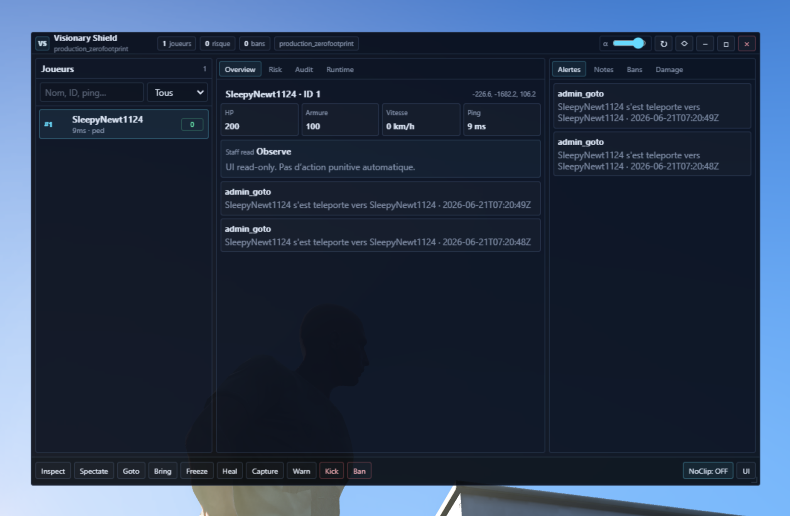
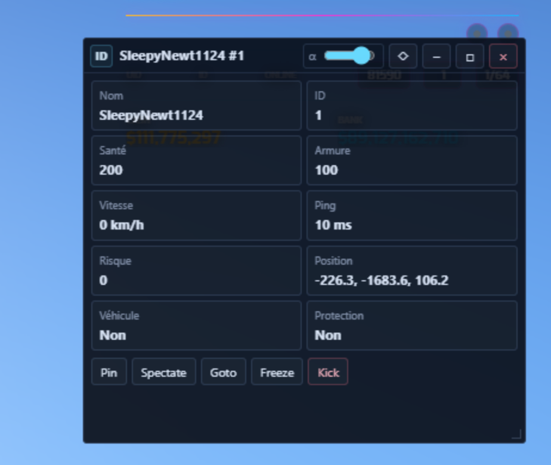
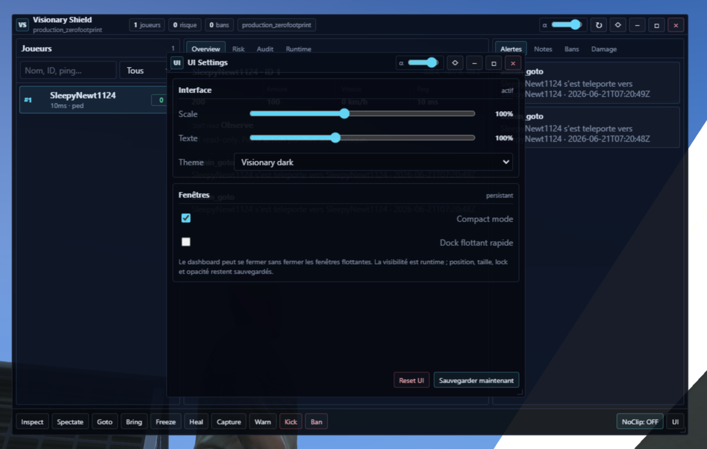
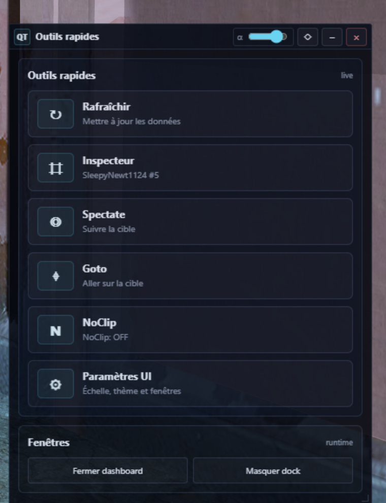

# Visionary Shield

<p align="center">
  <strong>Open-source FiveM/QBCore admin and security toolkit.</strong><br>
  Compact NUI, moderation workflows, runtime monitoring and screenshot evidence support.
</p>

<p align="center">
  
  
  
  
</p>

> Security should not be a luxury.
>
> Visionary Shield is released openly so server owners can audit, learn, improve and deploy stronger defensive tooling without relying on opaque black boxes.



## Why this project exists

Many small FiveM communities need better moderation and visibility, but security tooling is often closed, expensive, hard to audit, or uncomfortable for staff to use. Visionary Shield focuses on practical server operation: clear signals, compact UI, screenshot evidence, staff-led decisions and low idle overhead.

It is not marketed as a magic anti-cheat. It is a transparent defensive layer designed to help staff react faster and keep communities safer.

## Highlights

- Compact ImGui-inspired NUI for administrators
- Player inspector and floating quick tools
- Runtime-aware interface: disabled backend features are not shown as active controls
- Staff actions: inspect, spectate, goto, bring, freeze, heal, warn, kick, ban
- NUI-native moderation dialogs, no browser prompt popups
- Screenshot evidence flow using standalone `screenshot-basic`
- Per-admin UI layout, opacity, scale and text scale settings
- Config-driven localization from `shared/config.lua`
- `/zvs_resetui` resets only the current admin UI layout
- QBCore-friendly, Lua 5.4, `fx_version 'cerulean'`

## Screenshots

| Dashboard | Inspector |
|---|---|
|  |  |

| UI Settings | Quick Tools |
|---|---|
|  |  |

## Requirements

- FXServer with `cerulean` resources
- Lua 5.4 enabled
- QBCore recommended
- [`screenshot-basic`](https://github.com/citizenfx/screenshot-basic) started before this resource

## Quick installation

```cfg
ensure screenshot-basic
ensure zvs-ac
```

Then edit:

```text
shared/config.lua
```

Add your staff identifiers, language and optional Discord webhooks.

```lua
zVS.Config.AdminIdentifiers = {
    'license:xxxxxxxxxxxxxxxxxxxxxxxxxxxxxxxxxxxxxxxx',
    'discord:112233445566778899',
}

zVS.Config.Localization.DefaultLocale = 'en' -- or 'fr'
zVS.Config.Webhook = '' -- optional Discord webhook
```

## Admin commands

```text
/zvsadmin      Open or close the admin dashboard
/zvs_resetui   Reset only the current admin UI layout
```

## Documentation

- [Deployment guide](docs/DEPLOYMENT.md)
- [Configuration guide](docs/CONFIGURATION.md)
- [Localization guide](docs/LOCALIZATION.md)
- [Screenshot-basic setup](docs/SCREENSHOTS.md)
- [Troubleshooting / repair guide](docs/TROUBLESHOOTING.md)
- [Architecture overview](docs/ARCHITECTURE.md)
- [Roadmap](ROADMAP.md)
- [Security policy](SECURITY.md)
- [Contributing](CONTRIBUTING.md)

## Community

Stars, issues, pull requests and real server feedback help the project improve. Useful contributions include translations, documentation fixes, reproducible bug reports, QBCore compatibility notes and performance testing.

Good first contributions:

- add a new locale in `shared/config.lua`;
- improve installation docs for your platform;
- report UI edge cases with screenshots;
- share safe performance findings from real servers.

## License

This project is released under **GPL-3.0-or-later**.

You may use, study, modify and redistribute it under the license terms. Contributions are welcome.
